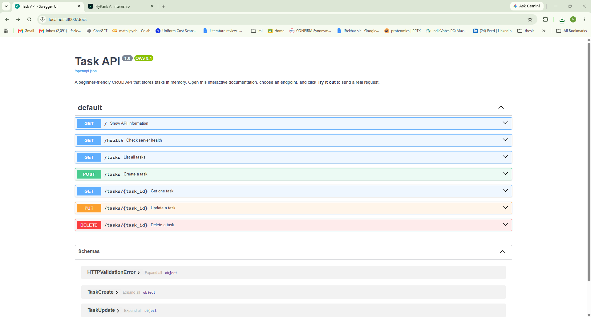

# Task CRUD API

A beginner-friendly **in-memory to-do list CRUD API** built with Python and FastAPI. The API supports creating, reading, updating, and deleting tasks, uses the required HTTP status codes, returns JSON error messages, and provides interactive Swagger UI documentation.

> **Important:** Task data is stored only in a Python list. Restarting the server removes any changes made during the session and restores the three initial tasks. This is intentional because the assignment does not use a database or file storage.

## Features

- Full CRUD operations for to-do tasks
- Three preloaded example tasks
- In-memory storage with no database
- Validation for POST and PUT request bodies
- JSON error responses
- Correct HTTP status codes: `200`, `201`, `204`, `400`, and `404`
- Swagger UI at `/docs`
- ReDoc documentation at `/redoc`
- Automated API tests with pytest
- Stage-by-stage Git commit history
- Separate AI-generated version for comparison

## Technology Stack

- Python 3.10+
- FastAPI
- Uvicorn
- Pydantic
- Pytest
- Git and GitHub

## Project Structure

```text
task-crud-api-assignment/
├── main.py
├── requirements.txt
├── requirements-dev.txt
├── pytest.ini
├── README.md
├── .gitignore
├── ai-comparison.txt
├── ai-version/
│   └── main.py
├── screenshots/
│   └── swagger-ui.png
└── tests/
    └── test_api.py
```

## Installation

### 1. Clone the repository

```bash
git clone https://github.com/YOUR-USERNAME/task-crud-api-assignment.git
cd task-crud-api-assignment
```

Replace `YOUR-USERNAME` with your GitHub username.

### 2. Create a virtual environment

#### Windows CMD

```cmd
python -m venv venv
venv\Scripts\activate
```

#### Windows PowerShell

```powershell
python -m venv venv
.\venv\Scripts\Activate.ps1
```

#### Linux or macOS

```bash
python3 -m venv venv
source venv/bin/activate
```

### 3. Install the dependencies

```bash
pip install -r requirements.txt
```

## Run the API

Run the following command from the project folder:

```bash
uvicorn main:app --reload
```

The API will be available at:

- API information: `http://localhost:8000/`
- Health check: `http://localhost:8000/health`
- Swagger UI: `http://localhost:8000/docs`
- ReDoc: `http://localhost:8000/redoc`

## Task Format

Each task contains an automatically generated numeric ID, a title, and a completion status.

```json
{
  "id": 1,
  "title": "Learn HTTP",
  "done": false
}
```

For `POST /tasks`, the client sends only the title:

```json
{
  "title": "Buy milk"
}
```

The server automatically generates the ID and sets `done` to `false`.

## API Endpoints

| Method | Endpoint | Description | Success code | Possible errors |
|---|---|---|---:|---:|
| GET | `/` | Display API information | 200 | — |
| GET | `/health` | Check whether the API is running | 200 | — |
| GET | `/tasks` | Return all tasks | 200 | — |
| GET | `/tasks/{task_id}` | Return one task by ID | 200 | 404 |
| POST | `/tasks` | Create a new task | 201 | 400 |
| PUT | `/tasks/{task_id}` | Update a task's title, done value, or both | 200 | 400, 404 |
| DELETE | `/tasks/{task_id}` | Delete a task | 204 | 404 |

## Request Examples

### List all tasks

```bash
curl -i http://localhost:8000/tasks
```

### Get one task

```bash
curl -i http://localhost:8000/tasks/1
```

### Create a task

#### Windows CMD

```cmd
curl.exe -i -X POST http://localhost:8000/tasks -H "Content-Type: application/json" -d "{\"title\":\"Buy milk\"}"
```

#### Git Bash, Linux, or macOS

```bash
curl -i -X POST http://localhost:8000/tasks \
  -H "Content-Type: application/json" \
  -d '{"title":"Buy milk"}'
```

Expected response code:

```text
201 Created
```

Example response body:

```json
{
  "id": 4,
  "title": "Buy milk",
  "done": false
}
```

### Update a task

#### Windows CMD

```cmd
curl.exe -i -X PUT http://localhost:8000/tasks/4 -H "Content-Type: application/json" -d "{\"title\":\"Buy milk and bread\",\"done\":true}"
```

#### Git Bash, Linux, or macOS

```bash
curl -i -X PUT http://localhost:8000/tasks/4 \
  -H "Content-Type: application/json" \
  -d '{"title":"Buy milk and bread","done":true}'
```

### Delete a task

```bash
curl -i -X DELETE http://localhost:8000/tasks/4
```

A successful deletion returns:

```text
204 No Content
```

The response body is empty.

## Validation and Error Responses

### Invalid POST or PUT body

Missing, empty, invalid, or unexpected request fields return `400 Bad Request`.

Example invalid body:

```json
{
  "title": ""
}
```

Example response:

```json
{
  "error": "Invalid request body",
  "details": [
    {
      "field": "title",
      "message": "Value error, Title must not be empty"
    }
  ]
}
```

### Unknown task ID

Requesting a task that does not exist returns `404 Not Found`.

Example request:

```bash
curl -i http://localhost:8000/tasks/99
```

Example response:

```json
{
  "error": "Task 99 not found"
}
```

## Actual `curl -i` Output

The following output was captured from the running API:

```text
HTTP/1.1 200 OK
date: Fri, 17 Jul 2026 14:51:04 GMT
server: uvicorn
content-length: 42
content-type: application/json

{"id":1,"title":"Learn HTTP","done":false}
```

## Swagger UI

Open `http://localhost:8000/docs` in a browser. Select an endpoint, click **Try it out**, enter the required data, and click **Execute**.

The full CRUD cycle can be tested from Swagger UI:

1. Create a task with `POST /tasks`.
2. List the tasks with `GET /tasks`.
3. Update the created task with `PUT /tasks/{task_id}`.
4. Delete it with `DELETE /tasks/{task_id}`.
5. Run `GET /tasks` again to confirm the deletion.



## Automated Tests

Install the development dependencies:

```bash
pip install -r requirements-dev.txt
```

Run the tests:

```bash
pytest -q
```

The tests check the required CRUD behavior, validation, JSON errors, and HTTP status codes.

## In-Memory Storage Observation

After creating, updating, or deleting tasks, stopping and restarting the server removes those changes and restores the original three tasks.

This occurs because the task list is stored in Python variables in RAM. In-memory storage is temporary, while a database provides persistent storage. The lack of persistence is intentional in this assignment.

## Git Commit History

The project was developed in separate stages with meaningful Git commits:

1. `Stage 0: hello server`
2. `Stage 1: root and health endpoints`
3. `Stage 2: read endpoints with 404`
4. `Stage 3: create with validation`
5. `Stage 4: full CRUD`
6. `Stage 5: Swagger UI`
7. `Stage 6: publish and docs`
8. `Stage 7: AI vs me`

View the commit history with:

```bash
git log --oneline
```

## AI vs Me

The original CRUD API in `main.py` was built first. The AI-generated implementation was then created separately in `ai-version/main.py` so that the original submission remained unchanged.

### Original AI Prompt

```text
Build a Python FastAPI CRUD API for managing an in-memory to-do task list.

Requirements:
- Use FastAPI and Python.
- Store tasks in a Python list, without a database or file storage.
- Each task must have id, title, and done fields.
- Include three initial example tasks.
- Add GET / for API information.
- Add GET /health returning {"status": "ok"}.
- Add GET /tasks to return all tasks.
- Add GET /tasks/{id} to return one task.
- Add POST /tasks to create a task. The client sends only title. Generate the id automatically and set done to false.
- Add PUT /tasks/{id} to update title and/or done.
- Add DELETE /tasks/{id} and return 204 with no response body.
- Return 400 for missing, empty, or invalid request bodies.
- Return 404 with JSON error messages for unknown task IDs.
- Use the correct status codes: 200, 201, 204, 400, and 404.
- Swagger UI must work at /docs.
- Put the complete implementation in one main.py file.
```

### Running the AI Version

Run the AI version on a separate port so that it does not conflict with the original API:

```cmd
cd ai-version
uvicorn main:app --reload --port 8001
```

Open its Swagger UI at:

```text
http://localhost:8001/docs
```

### Comparing the Implementations

The two versions were compared with:

```cmd
git diff --no-index main.py ai-version\main.py
```

The raw line-by-line output is saved in `ai-comparison.txt`.

### Concrete Differences

1. **ID generation:**  
   My version uses a global `next_task_id` counter. The AI version calculates the next ID by finding the largest ID currently in the task list and adding one.

2. **Response models:**  
   The AI version defines a separate `Task` Pydantic response model and uses `response_model` in its task endpoints. My version returns typed dictionaries without a separate response model.

3. **Testing support:**  
   My version includes a `reset_tasks()` helper to restore the initial data during automated tests. The AI version does not include this helper.

4. **API documentation:**  
   My version explicitly enables both Swagger UI and ReDoc. The AI version explicitly configures Swagger UI but does not separately configure ReDoc.

5. **Null-value validation:**  
   The AI version explicitly rejects `null` values for `title` and `done` during updates. My version handles optional fields differently and ignores a field when its value is `None`.

### What the AI Did Better

The AI version used explicit response models, which made the generated OpenAPI schema and Swagger documentation clearer. It also separated task lookup and ID generation into dedicated helper functions.

### What the AI Got Wrong or Decided Silently

The AI version did not fail the main CRUD requirements in the tested cases. However, its `max(current IDs) + 1` strategy can reuse an ID when the task with the highest ID is deleted. My version's monotonically increasing counter avoids reusing IDs during the same server session.

The prompt did not state how deleted IDs should be handled, so the AI made this design decision without an explicit instruction.

### What My First Prompt Forgot to Specify

The original prompt did not clearly specify:

- Whether deleted task IDs could be reused
- Whether ReDoc should also be enabled
- Whether a reset helper was required for testing
- How explicitly supplied `null` values should be handled
- Whether response models were required

### Improved Prompt for the Rematch

```text
Improve the previous Python FastAPI CRUD API while preserving all original requirements.

Additional requirements:
- Task IDs must never be reused during the same server session.
- Use a monotonically increasing next_task_id counter.
- Reject extra fields in POST and PUT request bodies.
- Return HTTP 400 instead of FastAPI's default 422 for every invalid request body.
- Reject missing, empty, invalid, and explicitly null values where they are not allowed.
- DELETE /tasks/{id} must return exactly HTTP 204 with an empty response body.
- Use clear response models and Swagger endpoint descriptions.
- Keep the complete implementation in one main.py file.
```

### Rematch Result

The improved prompt made the ID-generation rule explicit and removed the AI's need to make that decision independently. In the rematch, the implementation used a monotonically increasing task ID counter while preserving the required `400`, `404`, and empty `204` behavior.

### Main Lesson

The AI produced a functional implementation because the prompt specified the endpoints, storage method, validation rules, and status codes clearly. The comparison also showed that an AI may silently make design decisions whenever a requirement is not explicitly stated. Building the original version first made it possible to review those decisions critically.

## Publishing to GitHub

This project should be published in a public GitHub repository with its complete stage-by-stage commit history.

After creating an empty public repository on GitHub, run:

```bash
git branch -M main
git remote add origin https://github.com/YOUR-USERNAME/task-crud-api-assignment.git
git push -u origin main
```

Replace `YOUR-USERNAME` with your GitHub username.

For later updates:

```bash
git add -A
git commit -m "Update project documentation"
git push
```

## Assignment Completion Checklist

- [x] Server starts with one documented command
- [x] In-memory task storage
- [x] Three initial tasks
- [x] `GET /tasks`
- [x] `GET /tasks/{task_id}`
- [x] `POST /tasks`
- [x] `PUT /tasks/{task_id}`
- [x] `DELETE /tasks/{task_id}`
- [x] Correct `200`, `201`, `204`, `400`, and `404` status codes
- [x] JSON error messages
- [x] POST and PUT validation
- [x] Swagger UI at `/docs`
- [x] Swagger screenshot
- [x] Automated tests
- [x] Stage-by-stage Git commits
- [x] AI version stored separately
- [x] AI comparison and rematch analysis
- [ ] Public GitHub repository URL submitted
